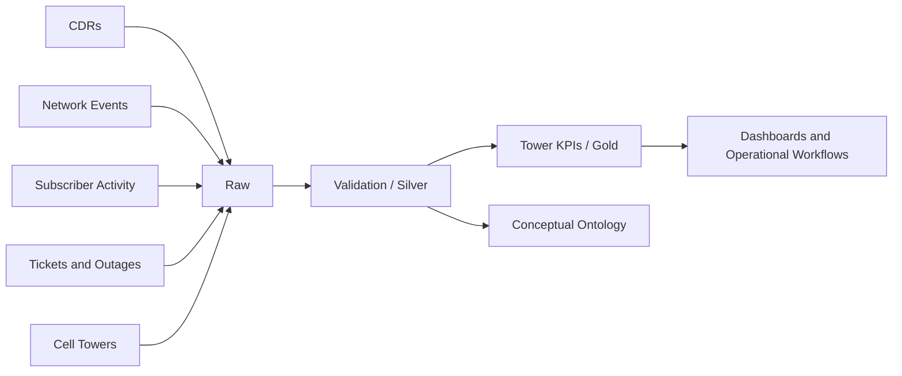

<p align="center">
  
</p>

# Telecom Network Intelligence Lakehouse Prototype

Portfolio project using **synthetic data only**. It demonstrates CDR processing, network-event analytics, data quality, Bronze/Silver/Gold design, conceptual ontology modeling, and a TypeScript incident workflow.

## Data sources

- `data/raw/cdr/cdr.csv`
- `data/raw/network_events/network_events.csv`
- `data/raw/subscriber_activity/subscriber_activity.csv`
- `data/raw/reference/cell_towers.csv`
- `data/raw/operations/service_tickets.csv`
- `data/raw/operations/outages.csv`

## Run

```bash
python -m venv .venv
.venv\Scripts\activate
pip install -r requirements.txt
python src/validate_input_data.py
python src/local_pipeline.py
```

## Architecture



## Interview explanation

I built a synthetic telecom network-intelligence lakehouse integrating CDRs, network events, subscriber activity, tower reference data, outages, and tickets. The validation layer enforces schemas and unique keys, while transformation logic generates call-drop, latency, signal-quality, utilization, availability, and congestion KPIs. I also modeled telecom business objects and a TypeScript incident-triage action.

Do not describe this repository as original client production code. Describe it as a personal prototype based on common telecom engineering patterns.
