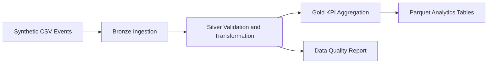

# Telecom Network Events Lakehouse Prototype

A portfolio-ready data engineering prototype that demonstrates how raw telecom network events can be ingested, validated, transformed, and aggregated into business-ready network quality metrics.

> This project uses entirely synthetic data. It does not contain employer code, client data, credentials, internal schemas, or confidential information.

## Business Problem

Network operations teams need reliable daily metrics to identify:

- Dropped-call hotspots
- High-latency regions
- Poor signal-strength areas
- Towers with abnormal event volumes
- Data-quality failures in incoming event feeds

## Architecture



## Technology Demonstrated

- Python
- PySpark and Spark SQL
- Medallion architecture: Bronze, Silver, Gold
- Schema enforcement
- Deduplication
- Data-quality validation
- Partitioned Parquet output
- Unit testing with pytest
- GitHub Actions CI

## Repository Structure

```text
telecom-network-events-lakehouse/
├── data/sample/network_events.csv
├── docs/architecture.md
├── src/generate_sample_data.py
├── src/pipeline.py
├── tests/test_pipeline.py
├── .github/workflows/tests.yml
├── requirements.txt
├── .gitignore
└── README.md
```

## Pipeline Logic

### Bronze

- Reads raw CSV network events
- Applies an explicit schema
- Adds an ingestion timestamp
- Preserves the original source values

### Silver

- Parses event timestamps
- Casts numeric columns
- Removes duplicate event IDs
- Filters invalid event types
- Rejects records with missing business keys
- Creates quality flags such as `is_dropped_call` and `is_poor_quality`

### Gold

Creates daily network KPIs by region and cell tower:

- Total events
- Dropped calls
- Drop rate
- Average signal strength
- Average latency
- Poor-quality event count
- Total bytes used

## Run Locally

### 1. Prerequisites

Install Python and Java, then create a virtual environment.

```bash
python -m venv .venv
```

Windows:

```bash
.venv\Scripts\activate
```

macOS/Linux:

```bash
source .venv/bin/activate
```

### 2. Install dependencies

```bash
pip install -r requirements.txt
```

### 3. Generate additional synthetic records

```bash
python src/generate_sample_data.py --rows 1000
```

### 4. Run the pipeline

```bash
python src/pipeline.py
```

The pipeline writes:

```text
output/
├── bronze/
├── silver/
├── gold/
└── quality/
```

### 5. Run tests

```bash
pytest -q
```

## Example Interview Explanation

“I created a telecom network-event lakehouse prototype using PySpark and a Bronze, Silver, and Gold architecture. The Bronze layer preserves raw events with ingestion metadata. The Silver layer performs schema enforcement, timestamp parsing, deduplication, business-rule validation, and data-quality flagging. The Gold layer calculates tower- and region-level KPIs such as dropped-call rate, average latency, and signal quality. I used synthetic data to protect confidentiality and structured the repository so the same design can be deployed to Databricks, AWS, Azure, or GCP.”

## Production Enhancements

- Replace CSV ingestion with Kafka or cloud object storage
- Write Delta Lake tables instead of Parquet
- Add checkpointing and Structured Streaming
- Add Great Expectations or Deequ checks
- Add Airflow or Databricks Workflows orchestration
- Add Terraform for cloud infrastructure
- Add dashboards in Power BI, Looker, or Grafana
- Add alerting for SLA and data-quality failures
