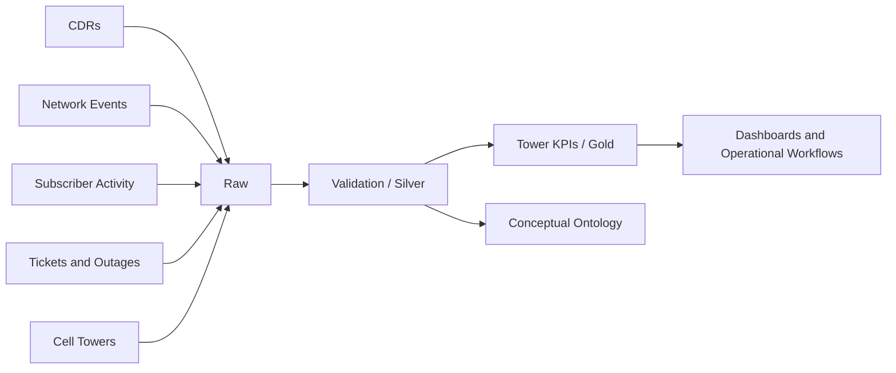

<p align="center">
  
</p>

# Telecom Network Intelligence Lakehouse Prototype

Portfolio project using **synthetic data only**. It demonstrates CDR processing, network-event analytics, data quality, Bronze/Silver/Gold design, conceptual ontology modeling, and a TypeScript incident workflow.

## Data sources

- `data/raw/cdr/cdr.csv`
- `data/raw/network_events/network_events.csv`
- `data/raw/subscriber_activity/subscriber_activity.csv`
- `data/raw/reference/cell_towers.csv`
- `data/raw/operations/service_tickets.csv`
- `data/raw/operations/outages.csv`

## Run

## Run the Project

This prototype simulates a telecom network intelligence pipeline using synthetic data.  
It validates raw input files, transforms them into curated datasets, and generates KPI outputs for analysis.

### What this project does

The pipeline performs the following:

- Reads synthetic telecom datasets such as:
  - Call Detail Records (CDRs)
  - Network Events
  - Subscriber Activity
  - Cell Towers
  - Service Tickets
  - Outages
- Validates schema and required fields
- Removes duplicate records
- Standardizes timestamps and key attributes
- Builds Silver datasets for validated data
- Generates Gold KPI datasets for:
  - Call drop rate
  - Average latency
  - Signal quality
  - Tower utilization
  - Availability
  - Ticket summaries
  - Outage summaries

---

### Prerequisites

Make sure the following are installed on your machine:

- Python 3.10 or above
- pip
- (Optional) virtual environment support
- (Optional) Java if you want to run the PySpark version

---

### Setup Instructions

#### 1. Create a virtual environment

```bash
python -m venv .venv

.venv\Scripts\activate
source .venv/bin/activate
pip install -r requirements.txt

## Architecture



## Interview explanation

I built a synthetic telecom network-intelligence lakehouse integrating CDRs, network events, subscriber activity, tower reference data, outages, and tickets. The validation layer enforces schemas and unique keys, while transformation logic generates call-drop, latency, signal-quality, utilization, availability, and congestion KPIs. I also modeled telecom business objects and a TypeScript incident-triage action.

Do not describe this repository as original client production code. Describe it as a personal prototype based on common telecom engineering patterns.
