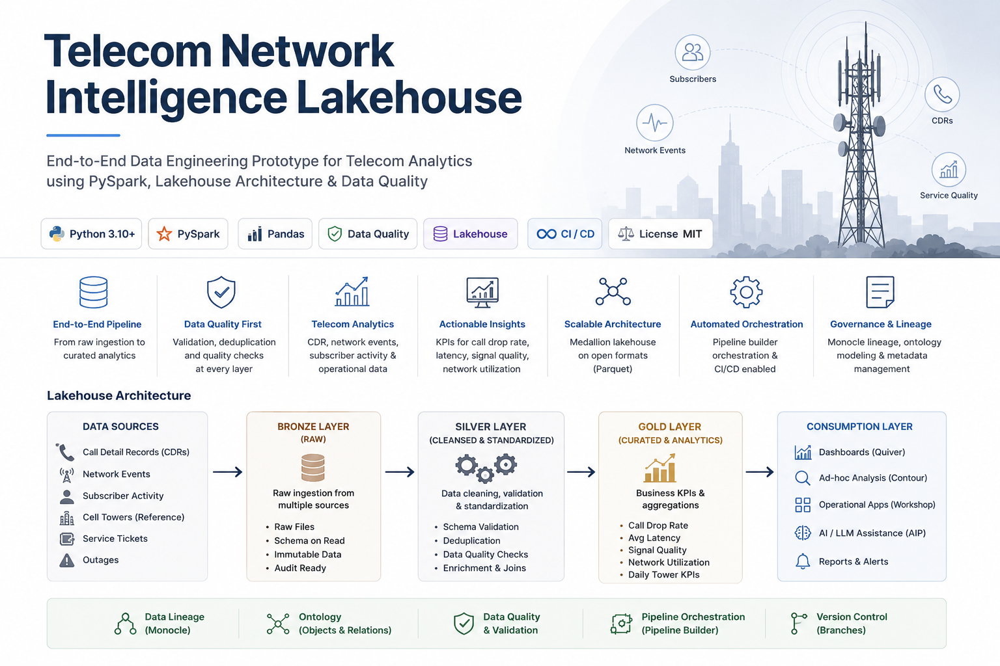

<p align="center">
  
</p>

# Telecom Network Intelligence Lakehouse Prototype

Portfolio project using **synthetic data only**. It demonstrates CDR processing, network-event analytics, data quality, Bronze/Silver/Gold design, conceptual ontology modeling, and a TypeScript incident workflow.

## Data sources

- `data/raw/cdr/cdr.csv`
- `data/raw/network_events/network_events.csv`
- `data/raw/subscriber_activity/subscriber_activity.csv`
- `data/raw/reference/cell_towers.csv`
- `data/raw/operations/service_tickets.csv`
- `data/raw/operations/outages.csv`

## Run the Project

This prototype simulates a telecom network intelligence pipeline using synthetic data.  
It validates raw input files, transforms them into curated datasets, and generates KPI outputs for analysis.

### What this project does

The pipeline performs the following:

- Reads synthetic telecom datasets such as:
  - Call Detail Records (CDRs)
  - Network Events
  - Subscriber Activity
  - Cell Towers
  - Service Tickets
  - Outages
- Validates schema and required fields
- Removes duplicate records
- Standardizes timestamps and key attributes
- Builds Silver datasets for validated data
- Generates Gold KPI datasets for:
  - Call drop rate
  - Average latency
  - Signal quality
  - Tower utilization
  - Availability
  - Ticket summaries
  - Outage summaries

---

### Prerequisites

Make sure the following are installed on your machine:

- Python 3.10 or above
- pip
- (Optional) virtual environment support
- (Optional) Java if you want to run the PySpark version

---

### Setup Instructions

#### 1. Create a virtual environment

```bash
python -m venv .venv

.venv\Scripts\activate

source .venv/bin/activate

pip install -r requirements.txt

python src/validate_input_data.py

python src/local_pipeline.py

python src/pyspark_pipeline.py

data/processed/gold/

python src/replace_data.py --source "path/to/new_data"

pytest -q


## Architecture

```md
## Architecture

This project follows a **Bronze / Silver / Gold lakehouse pattern** for telecom data engineering.

```mermaid
flowchart LR
    subgraph A[Data Sources]
        A1[Call Detail Records]
        A2[Network Events]
        A3[Subscriber Activity]
        A4[Cell Tower Reference]
        A5[Service Tickets]
        A6[Outages]
    end

    subgraph B[Bronze Layer - Raw Ingestion]
        B1[Raw Landing Data]
        B2[Source Preservation]
        B3[Schema-on-Read]
    end

    subgraph C[Silver Layer - Validation and Standardization]
        C1[Schema Validation]
        C2[Deduplication]
        C3[Quality Checks]
        C4[Timestamp Standardization]
        C5[Enrichment and Joins]
    end

    subgraph D[Gold Layer - Curated Analytics]
        D1[Daily Tower KPIs]
        D2[Call Drop Rate]
        D3[Latency and Signal Quality]
        D4[Utilization and Availability]
        D5[Ticket and Outage Summaries]
    end

    subgraph E[Consumption and Business Use]
        E1[Dashboards]
        E2[Ad-hoc Analysis]
        E3[Operational Workflows]
        E4[AI Assisted Triage]
    end

    A --> B
    B --> C
    C --> D
    D --> E

## Interview explanation

I built a synthetic telecom network-intelligence lakehouse integrating CDRs, network events, subscriber activity, tower reference data, outages, and tickets. The validation layer enforces schemas and unique keys, while transformation logic generates call-drop, latency, signal-quality, utilization, availability, and congestion KPIs. I also modeled telecom business objects and a TypeScript incident-triage action.

Do not describe this repository as original client production code. Describe it as a personal prototype based on common telecom engineering patterns.
