<p align="center">
  
</p>

# Telecom Network Intelligence Lakehouse Prototype

Portfolio project using **synthetic data only**. It demonstrates CDR processing, network-event analytics, data quality, Bronze/Silver/Gold design, conceptual ontology modeling, and a TypeScript incident workflow.

## Data sources

- `data/raw/cdr/cdr.csv`
- `data/raw/network_events/network_events.csv`
- `data/raw/subscriber_activity/subscriber_activity.csv`
- `data/raw/reference/cell_towers.csv`
- `data/raw/operations/service_tickets.csv`
- `data/raw/operations/outages.csv`

## Run the Project

This prototype simulates a telecom network intelligence pipeline using synthetic data.  
It validates raw input files, transforms them into curated datasets, and generates KPI outputs for analysis.

### What this project does

The pipeline performs the following:

- Reads synthetic telecom datasets such as:
  - Call Detail Records (CDRs)
  - Network Events
  - Subscriber Activity
  - Cell Towers
  - Service Tickets
  - Outages
- Validates schema and required fields
- Removes duplicate records
- Standardizes timestamps and key attributes
- Builds Silver datasets for validated data
- Generates Gold KPI datasets for:
  - Call drop rate
  - Average latency
  - Signal quality
  - Tower utilization
  - Availability
  - Ticket summaries
  - Outage summaries

---

### Prerequisites

Make sure the following are installed on your machine:

- Python 3.10 or above
- pip
- (Optional) virtual environment support
- (Optional) Java if you want to run the PySpark version

---
### Setup Instructions

#### 1. Create a virtual environment

```bash
python -m venv .venv
```

#### 2. Activate the virtual environment

**Windows**

```bash
.venv\Scripts\activate
```

**Mac / Linux**

```bash
source .venv/bin/activate
```

#### 3. Install required dependencies

```bash
pip install -r requirements.txt
```

#### 4. Validate the source data

```bash
python src/validate_input_data.py
```

#### 5. Run the local Python pipeline

```bash
python src/local_pipeline.py
```

#### 6. Run the PySpark pipeline

```bash
python src/pyspark_pipeline.py
```

#### 7. Review the generated outputs

```text
data/processed/gold/
```

Main output files:

```text
daily_tower_kpis.csv
ticket_summary.csv
outage_summary.csv
```

#### 8. Replace the source data

```bash
python src/replace_data.py --source "path/to/new_data"
```

#### 9. Run automated tests

```bash
pytest -q
```

---


## Architecture

This project follows a **Bronze / Silver / Gold lakehouse pattern** for telecom data engineering.

```mermaid
flowchart TB

    subgraph SOURCES["1. Telecom Data Sources"]
        direction LR
        A1["📞 Call Detail Records"]
        A2["📡 Network Events"]
        A3["👥 Subscriber Activity"]
        A4["🗼 Cell Tower Reference"]
        A5["🎫 Service Tickets"]
        A6["⚠️ Outages"]
    end

    subgraph BRONZE["2. Bronze Layer — Raw Ingestion"]
        direction LR
        B1["Raw File Landing"]
        B2["Source Preservation"]
        B3["Schema-on-Read"]
        B4["Ingestion Metadata"]
    end

    subgraph SILVER["3. Silver Layer — Validated and Standardized"]
        direction LR
        C1["Schema Validation"]
        C2["Deduplication"]
        C3["Timestamp Standardization"]
        C4["Data Quality Rules"]
        C5["Enrichment and Joins"]
    end

    subgraph GOLD["4. Gold Layer — Curated Telecom Analytics"]
        direction LR
        D1["Daily Tower KPIs"]
        D2["Call Drop Rate"]
        D3["Latency and Signal Quality"]
        D4["Utilization and Availability"]
        D5["Ticket and Outage Summary"]
    end

    subgraph CONSUMPTION["5. Analytics and Operational Consumption"]
        direction LR
        E1["📊 Dashboards"]
        E2["🔎 Ad-hoc Analysis"]
        E3["⚙️ Operational Workflows"]
        E4["🤖 AI-Assisted Incident Triage"]
        E5["🔔 Reports and Alerts"]
    end

    SOURCES --> BRONZE
    BRONZE --> SILVER
    SILVER --> GOLD
    GOLD --> CONSUMPTION

    classDef source fill:#EAF2FF,stroke:#2563EB,stroke-width:2px,color:#102A43
    classDef bronze fill:#FFF4E5,stroke:#D97706,stroke-width:2px,color:#5C2D00
    classDef silver fill:#F1F5F9,stroke:#64748B,stroke-width:2px,color:#1E293B
    classDef gold fill:#FFF9DB,stroke:#CA8A04,stroke-width:2px,color:#4A3600
    classDef consume fill:#ECFDF5,stroke:#059669,stroke-width:2px,color:#064E3B

    class A1,A2,A3,A4,A5,A6 source
    class B1,B2,B3,B4 bronze
    class C1,C2,C3,C4,C5 silver
    class D1,D2,D3,D4,D5 gold
    class E1,E2,E3,E4,E5 consume

    style SOURCES fill:#F8FBFF,stroke:#2563EB,stroke-width:2px
    style BRONZE fill:#FFFBF4,stroke:#D97706,stroke-width:2px
    style SILVER fill:#F8FAFC,stroke:#64748B,stroke-width:2px
    style GOLD fill:#FFFDF2,stroke:#CA8A04,stroke-width:2px
    style CONSUMPTION fill:#F3FCF8,stroke:#059669,stroke-width:2px
```



### End-to-End Data Flow

1. Synthetic telecom data is ingested from CDR, network-event, subscriber, tower, ticket and outage files.
2. The Bronze layer preserves the source records and ingestion metadata.
3. The Silver layer validates schemas, removes duplicates, standardizes timestamps and applies quality rules.
4. The Gold layer produces business-ready KPIs for tower performance, call quality, congestion, tickets and outages.
5. Curated outputs support dashboards, operational investigation, alerting and AI-assisted incident triage.

### Architecture Layers

| Layer | Purpose | Main Outputs |
|---|---|---|
| **Data Sources** | Synthetic telecom source datasets | CDRs, network events, subscriber activity, towers, tickets and outages |
| **Bronze** | Preserves source data in its original structure | Raw files under `data/raw/` |
| **Silver** | Validates, cleans, standardizes and enriches records | Validated telecom datasets |
| **Gold** | Creates business-ready aggregations and KPIs | Tower KPIs, ticket summaries and outage summaries |
| **Consumption** | Supports analytics and operational use cases | Dashboards, investigations, alerts and AI-assisted triage |

### Business Use Cases

- Call-drop analysis
- Network latency monitoring
- Signal-quality analysis
- Tower congestion detection
- Service-availability reporting
- Capacity planning
- Outage impact analysis
- Operational issue tracking
- AI-assisted incident triage

---

## Interview explanation

I built a synthetic telecom network-intelligence lakehouse integrating CDRs, network events, subscriber activity, tower reference data, outages, and tickets. The validation layer enforces schemas and unique keys, while transformation logic generates call-drop, latency, signal-quality, utilization, availability, and congestion KPIs. I also modeled telecom business objects and a TypeScript incident-triage action.

Do not describe this repository as original client production code. Describe it as a personal prototype based on common telecom engineering patterns.
